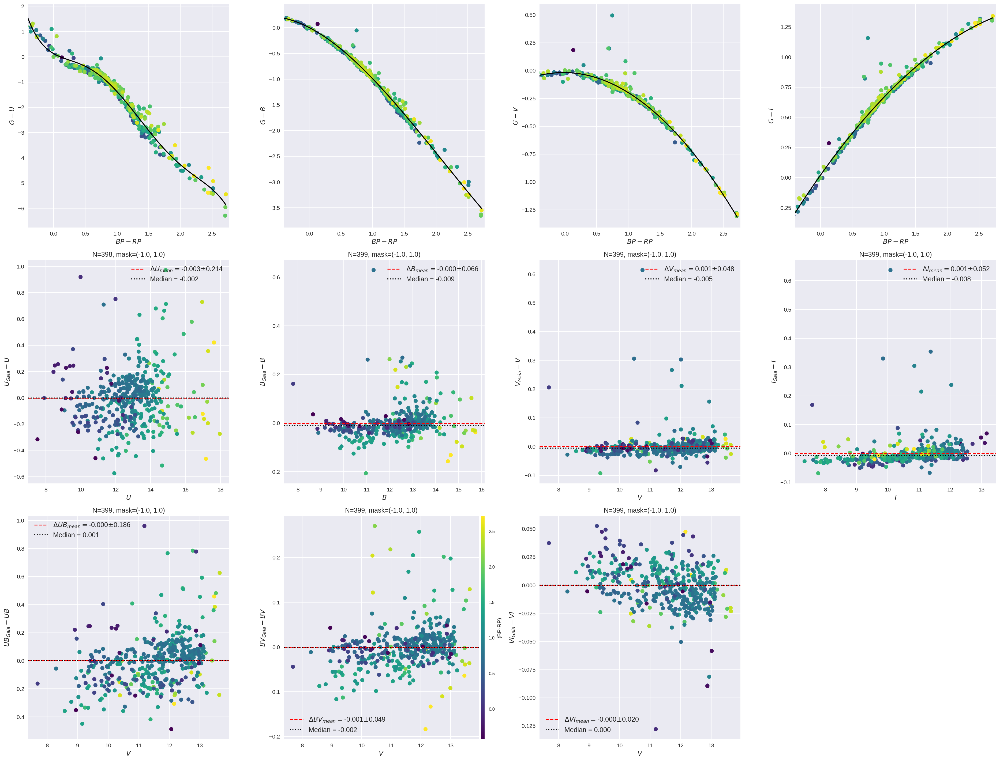

Plot [Carrasco's transformation polynomials][1] between UBVI
and Gaia DR2 data.

The result of using this script on Carrascos' list of Landolt standards is this:

[1]: https://gea.esac.esa.int/archive/documentation/GDR2/Data_processing/chap_cu5pho/sec_cu5pho_calibr/ssec_cu5pho_PhotTransf.html